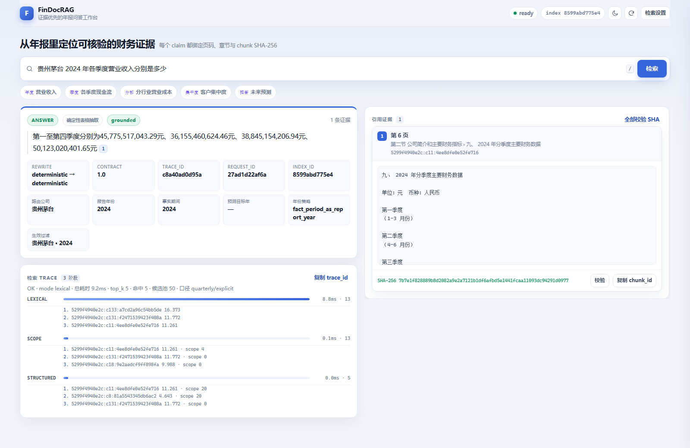

# FinDocRAG

[](https://github.com/pengruoxin/findoc-rag/actions/workflows/ci.yml)
[](https://www.python.org/)
[](https://fastapi.tiangolo.com/)
[](./LICENSE)

面向中文上市公司年报的证据优先 Agentic RAG：能够解析原生与扫描 PDF，执行检索、抽取、
比较、计算和核验任务，并把每项结论绑定到页码、坐标、引用与内容哈希。

```bash
docker compose up --build     # http://127.0.0.1:8000
```

镜像自带一个可查询的最小 demo 索引，不需要 API key 或模型下载。demo 仅用于体验界面，
不用于复现下文的完整评测指标。



## 目录

- [核心亮点](#核心亮点)
- [系统架构](#系统架构)
- [评测结果](#评测结果)
- [快速开始](#快速开始)
- [运行 Agent](#运行-agent)
- [模型与成本](#模型与成本)
- [复现评测](#复现评测)
- [项目边界](#项目边界)
- [文档](#文档)

## 核心亮点

### 1. 按风险启用的双 Agent

主 Agent 负责规划并执行 `compare / calculate / extract` 等任务；抽取任务命中审计、多事实
或开放风险信号时，系统会自动启用隔离上下文的 Evidence Verifier Agent，独立检查原子事实、
claim、引用和逐字 support proof。验证失败最多修复一次并再次复核，仍无法证明时才进入人工
审核。普通任务保持单 Agent，避免为所有请求支付双倍成本。

本地执行器始终负责参数、证据、引用与停止条件校验，因此模型不能直接绕过门禁；人工结论
也不会被计作自动成功。两个 Agent 默认都使用 DeepSeek，独立的是角色和上下文，而不是
模型供应商。

当前主 Agent 评测集 `agent-hard-v3` 共 96 题，覆盖 8 家公司、16 份官方年报和 2023–2024
两个年度。已执行的 calibration 与 dev 共 48 题，严格自动通过率为 **94%**、行为准确率为
**100%**；另外 48 题 frozen test 仍保持封存。高重叠风险集从 **93% 提升到 100%**
（15 个故障案例），unsafe answer 从 1 降为 **0**。

### 2. 真实扫描 PDF 的自适应恢复

解析链路采用 native-first：可靠文本层直接使用，缺失或退化页面才进入 OCR。常规 OCR
无法恢复表格结构时，系统只重试失败页，并可使用红色通道抑制印章干扰。

在 4 页官方零文本层扫描开发集的 17 个结构单元格上，召回率按阶段从
**71% → 88% → 94% → 100%**。整页提升到 240 DPI 和 300 DPI 均没有额外收益；最终只对
**25% 的页面**执行红章抑制与 240 DPI 重识别，没有让模型猜测缺失值。

### 3. 表格是可验证的几何证据

PDF 会被解析为保留页、block、line、span、字体、旋转和 bbox 的 Document IR。表格管线使用
区域定位、行带聚类、列对齐、层级表头合并、换行行名恢复和跨页隔离，而不是只把表格
转成线性文本。

五类表型共 157 个单元格，坐标级恢复率从 **59% 提升到 98%**；安全选择后的 Precision
和 Recall 均为 **98%**。开发索引中的 176 个单元格，cell/region proof 覆盖率为
**100%**。

### 4. 公司与文档隔离的扩展评测

主 Agent 集已扩展到 **96 题、8 家公司、16 份年报、2 个年度**，按公司划分 calibration、
dev 和 frozen test；通用 RAG 集 `benchmark-v3` 包含 **60 题、6 家公司、10 份年报、
2 个年度**，同样按公司做文档盲测划分。公司在出题和规则调优前就已分配到固定 split，
避免同一公司跨开发集和测试集泄漏。

旧的 2 家公司、1 个年度结果只保留为历史回归，不再作为首页主基线。

### 5. 可复现、可归因的评测闭环

PDF、benchmark、索引、artifact 与代码指纹均绑定 SHA-256。每个阶段报告记录指标、token、
延迟、失败样本与 fixed/regressed；评分器修正与真实能力提升分开记账。来源不可信、gold
未冻结、索引不匹配或证据不足时统一 fail-closed。

当前代码快照共有 **450 项测试通过**。

## 系统架构

```text
官方 PDF / 用户上传
  → native-first PDF 路由
      ├─ 可靠文本层：直接解析
      └─ 扫描/退化页：RapidOCR → 失败页自适应重识别
  → Document IR（页、阅读顺序、字体、旋转、bbox、来源）
  → 结构感知切片与不可变语料索引
  → 元数据过滤 + BM25 默认检索 + 可选 dense/RRF/重排
  → index-bound 表格 sidecar 与 cell/region proof
  → 主 DeepSeek tool-calling Agent
  → 本地证据与风险门禁（目标覆盖、数值、单位、引用、哈希）
      ├─ 普通任务且证据充分：返回可追溯答案
      ├─ 信息缺失：拒答或澄清
      └─ 高风险抽取：Evidence Verifier Agent（隔离上下文）
          ├─ 验证通过：返回答案
          ├─ 可修复：最多修复一次并重新验证
          └─ 仍无法证明：生成不可变人工审核包
```

主要接口：`/v1/search`、`/v1/query`、`/v1/capabilities`、`/v1/evidence:resolve`、
`/v1/uploads`、`/v1/uploads/{job_id}:process`、`/v1/traces/{trace_id}`、`/v1/metrics`。

## 评测结果

### 当前主评测口径

| 评测集 | 完整范围 | 当前已执行范围 | 当前结果 | Gold 状态 |
|---|---|---|---|---|
| `agent-hard-v3` | 96 题、8 家公司、16 份年报、2023–2024 | calibration + dev，48 题 | 严格自动通过率 **94%**；行为准确率 **100%** | 来源与页码已核对的 provisional gold；独立双审待完成 |
| `benchmark-v3` | 60 题、6 家公司、10 份年报、2023–2024 | frozen test，24 题，离线确定性基线 | strict **19%**；行为准确率 **33%**；远程模型未启用 | `independent_gold=false`；PDF 视觉复核待完成 |

`agent-hard-v3` 的 96 题由 56 个抽取任务、24 个比较任务和 16 个计算任务组成；预期行为包括
80 个正常回答、8 个安全拒答和 8 个澄清。frozen test 的 48 题尚未运行，因此不能把前 48
题的 94% 外推成全量成绩。

`benchmark-v3` 的 frozen 数字是扩展集上的起始离线基线，不是 DeepSeek 最终成绩。它被放在
这里是为了如实展示扩大公司和年度覆盖后出现的真实难度。

### PDF、表格与安全专项

| 能力 | 数据范围 | 当前结果 |
|---|---|---:|
| 高重叠风险门禁 | 15 个故障注入案例 | 通过率 **100%**，unsafe 0 |
| 真实扫描表恢复 | 4 页、30 探针、17 个结构单元格 | 结构召回 **100%**（开发集） |
| 坐标级表格重建 | 五类表型、157 个单元格 | 恢复率 **98%** |
| 表格安全选择 | 157 个预测单元格 | Precision **98%**，Recall **98%** |
| 跨页 PDF 回归 | 原生/栅格跨页表 | 路由、数值、结构 **100%** |

### 历史回归口径

旧 benchmark 的 48 题只覆盖 2 家公司和 1 个年度。其检索 Recall@5 为 **81%**、MRR@5 为
**69%**，DeepSeek 三轨 strict 与行为均为 **100%**；这些数字只用于确认旧能力没有回退，
不再作为项目主结果。

完整定义与产物路径见[当前基线](docs/evaluation/baseline-zh.md)。

## 快速开始

### Docker demo

```bash
git clone https://github.com/pengruoxin/findoc-rag.git
cd findoc-rag
docker compose up --build
```

服务只绑定 `127.0.0.1`。API 本身没有鉴权，不应直接暴露到公网。

### 本地开发

```bash
uv sync --extra dev --extra api --extra ocr
uv run findoc-rag doctor
uv run pytest -q

uv run python scripts/build_demo_index.py
FINDOC_RAG_INDEX_DIR=data/indexes/demo uv run findoc-rag serve
```

Dense 检索为可选能力，需要额外安装：

```bash
uv sync --extra dense
```

### 构建年报索引

```bash
uv run findoc-rag fetch-annual-report --company 贵州茅台 --year 2024
uv run findoc-rag ingest-document data/artifacts/cninfo/<report.pdf> \
  --document-key cninfo:600519:annual:2024
uv run findoc-rag build-corpus-index
```

## 运行 Agent

远程 Agent 需要 DeepSeek key。推荐使用被 `.gitignore` 忽略的 `local-keys.env`；不要把 key
写进源码、日志或提交记录。

```bash
export DEEPSEEK_API_KEY="..."

uv run findoc-rag agent run --task compare \
  --index-dir data/indexes/benchmark-v3 \
  "比较海尔智家和长江电力2024年营业收入"

uv run findoc-rag agent run --task extract \
  --index-dir data/indexes/benchmark-v3 \
  --source-manifest data/evaluation/benchmark-v3-source-manifest.json \
  "海尔智家2024年使用权资产表中，累计折旧期末余额合计是多少？"
```

抽取任务默认使用 `--verifier-policy auto`，也可以显式控制：

| 策略 | 行为 |
|---|---|
| `auto` | 默认；仅高风险抽取任务开启第二个 Agent |
| `always` | 所有已回答的抽取任务都进行独立复核 |
| `off` | 关闭第二个 Agent，用于消融或成本对照 |

查看任务与人工审核队列：

```bash
uv run findoc-rag agent inspect <task-id>
uv run findoc-rag agent review list
uv run findoc-rag agent review inspect <review-id>
uv run findoc-rag agent review resolve <review-id> approve --reviewer reviewer-a
```

没有 key 时远程评测会记录 `status=not_run`，不会用本地规则结果冒充 DeepSeek。离线对照
必须显式指定：

```bash
uv run findoc-rag agent run --runtime deterministic-baseline --task compare \
  --index-dir data/indexes/benchmark-v3 \
  "比较海尔智家和长江电力2024年营业收入"
```

## 模型与成本

| 环节 | 默认实现 | 是否需要远程模型 |
|---|---|---:|
| PDF 原生解析 | PyMuPDF | 否 |
| 扫描页 OCR | RapidOCR + ONNX Runtime | 否 |
| 检索 | BM25 | 否 |
| Dense 检索（可选） | `intfloat/multilingual-e5-small` | 否，需下载模型 |
| 重排（可选） | `BAAI/bge-reranker-v2-m3` | 否，需下载模型 |
| 生成与查询改写 | `deepseek-chat` | 是 |
| 主 Agent 工具调用 | `deepseek-v4-flash`，可配置 | 是 |
| Evidence Verifier Agent | 默认同为 `deepseek-v4-flash`，上下文隔离 | 是，仅高风险抽取触发 |

DeepSeek 不直接读取整份 PDF。PDF 解析、OCR、表格结构与坐标证据由本地管线处理；模型只接收
任务所需的有界证据。当前 Retrieved 平均上下文约 1,533 token，p95 延迟约 2.08 秒。

## 复现评测

```bash
# 全量测试与代码检查
uv run pytest -q
uv run ruff check .

# 真实扫描 PDF：常规 OCR、失败页自适应重识别、阶段汇总
uv run python scripts/evaluate_pdf_hard_v2_genuine_scans.py
uv run python scripts/evaluate_pdf_hard_v2_adaptive_ocr.py
uv run python scripts/summarize_pdf_hard_v2_improvements.py

# 检索、表格与 PDF 审计
uv run python scripts/run_retrieval_variant_eval.py \
  --output-dir reports/ranking/variant-regime-v3
uv run python scripts/evaluate_table_extraction.py \
  --output-dir reports/ranking/table-eval-v3
uv run python scripts/audit_pdf_pipeline.py \
  --output-dir reports/processing/pdf-audit-v2

# 真实 DeepSeek Agent 评测
uv run python scripts/evaluate_agent_hard.py --require-remote
```

评测产物写入 `reports/`，固定数据集与来源清单位于 `data/evaluation/`。扫描 PDF 的逐阶段
结果见 [PDF Hard v2 阶段报告](docs/evaluation/pdf-hard-v2-stage7-results-zh.md)。

## 项目边界

- 当前最大 Agent 集覆盖 8 家公司、16 份年报和 2 个年度；仍不足以代表全部行业和年度，
  不宣称通用 SOTA；
- `agent-hard-v3` 的 48 题 frozen test 尚未运行，当前 94% 只来自 calibration + dev；
- `agent-hard-v3` 仍是来源复核 provisional gold，独立双审尚未完成；
- `benchmark-v3` 覆盖 6 家公司、10 份年报和 2 个年度，但 `independent_gold=false`，扩展集
  远程 DeepSeek 结果尚未建立；
- 真实扫描结果来自 4 页视觉复核开发集，正式独立复核 gold 完成率仍为 **0%**
  （目标 70 个）；
- 旧 RAGAS 回答与 judge 都使用 DeepSeek，`independent_judge=false`，仅保留为历史诊断；
- 主 Agent 与 Verifier 默认来自同一模型供应商，可能共享模型盲点，尚不属于异构双 Agent；
- Precision/NDCG 使用部分判定，OOV 实例尚未完成独立人工审核；
- 扫描件、复杂合并单元格、跨页断表、低清倾斜与印章遮挡仍需扩充正式样本；
- API 没有内置鉴权，生产部署需要反向代理、认证和限流。

## 文档

- [总体路线图](docs/roadmap-zh.md)
- [Agent 任务与命令](docs/agent-tasks-zh.md)
- [当前基线与指标口径](docs/evaluation/baseline-zh.md)
- [评测规则](docs/evaluation/benchmark-and-metrics-zh.md)
- [实验结论索引](docs/evaluation/experiment-summaries.md)
- [PDF Hard v2 阶段结果](docs/evaluation/pdf-hard-v2-stage7-results-zh.md)
- [变更记录](docs/history/optimization-log-zh.md)
- [完整文档索引](docs/README.md)

## License

本项目采用 [MIT License](./LICENSE)。
