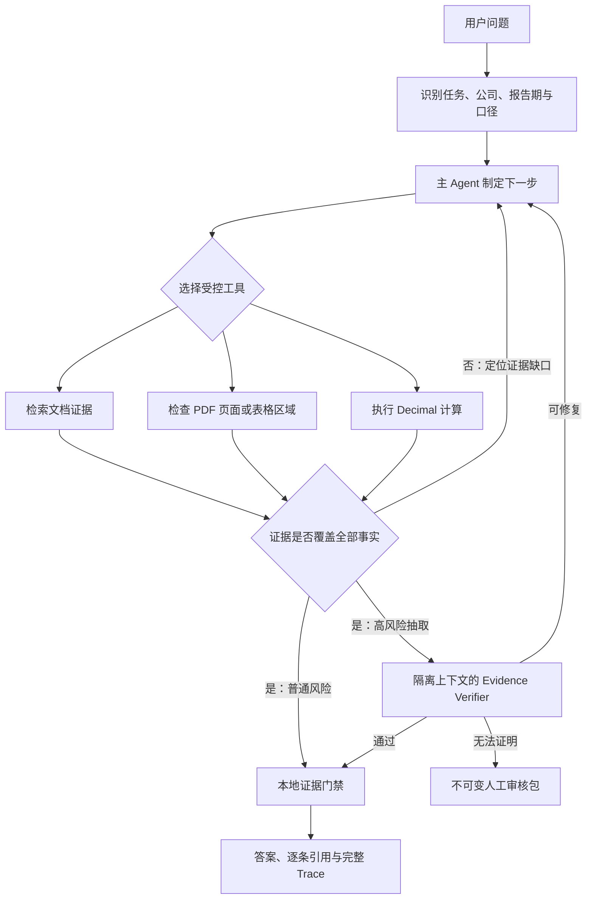

# FinDocRAG

[](https://github.com/pengruoxin/findoc-rag/actions/workflows/ci.yml)
[](https://www.python.org/)
[](https://fastapi.tiangolo.com/)
[](./LICENSE)

面向中文上市公司年报的证据优先文档 Agent。上传原生或扫描 PDF 后，它可以执行检索问答、
跨文档比较、表格抽取和带来源计算，并把结论绑定到原始页码、版面坐标、引用与内容哈希。

它不是“让模型直接阅读整份 PDF”：本地管线负责解析、OCR、检索、表格结构和证据校验，
DeepSeek 只在有界证据上规划任务与生成结论。证据不足时，系统会拒答、要求补充信息，或将
高风险结果送入独立复核和人工审核。


## 可以完成什么

| 任务 | 示例 | 系统行为 |
|---|---|---|
| 文档问答 | “贵州茅台 2024 年营业收入是多少？” | 检索相关段落，生成带页码引用的答案 |
| 跨文档比较 | “比较海尔智家和长江电力 2024 年营业收入” | 规划多个检索目标，分别取证后再比较 |
| 精确抽取 | “累计折旧期末余额合计是多少？” | 检查表头、行名、数值、单位和单元格坐标 |
| 带来源计算 | “计算营业收入同比增长率” | 从证据提取操作数，由本地 Decimal 工具计算 |
| 安全拒答 | “预测 2026 年全年营业收入” | 区分文档事实与预测，缺少证据时不猜测 |

所有任务最终都必须通过本地证据门禁。模型不能自行伪造引用、跳过工具校验或把人工修正冒充
自动成功。

## 三分钟体验

需要 Docker Engine 或 Docker Desktop，并启用 Compose：

```bash
git clone https://github.com/pengruoxin/findoc-rag.git
cd findoc-rag
docker compose up --build
```

打开 `http://127.0.0.1:8000`。镜像会构建一个最小演示索引，并通过 Docker volume 保留上传
文档、索引、任务轨迹和人工审核记录。

### 不输入 Key 时

- 浏览内置演示索引；
- 上传原生或扫描 PDF，并运行本地解析、OCR 和建索引；
- 检索原始证据，查看页码、章节、原文和防篡改信息。

### 输入 DeepSeek Key 后

- 生成自然语言答案；
- 运行对比、抽取和计算 Agent；
- 对高风险抽取按需启用 Evidence Verifier；
- 处理需要人工确认的审核任务。

Key 只保存在当前浏览器标签页内存中，并以请求头转发给服务；刷新页面即清除，服务端不会把
它写入配置文件或任务轨迹。

### 推荐体验路径

1. 在右上角确认服务状态；
2. 上传一份 PDF，等待解析与索引完成；
3. 如需 Agent 能力，在“模型”面板输入 DeepSeek Key；
4. 选择快速问答、对比分析、精确抽取或计算核验；
5. 点击答案中的引用，核对右侧证据卡片；
6. 展开“技术详情”时再查看 chunk ID、坐标和 SHA-256。

## 为什么不是普通 RAG



这里的 Agent 是有边界的：任务类型、工具参数、最大轮次、证据要求和停止条件都由本地控制器
约束。第二个 Agent 也不是固定开启；默认只在抽取任务出现多事实、开放风险或证据审计信号时
触发，避免普通问题承担额外模型调用。

## 核心实现

- **自适应 PDF 路由**：优先使用可靠文字层，只对缺失或退化页面运行 RapidOCR；常规 OCR
  失败时，仅重试问题页面，并可通过红色通道降低印章干扰。
- **保留版面的 Document IR**：记录 page、block、line、span、字体、旋转和 bbox，使表格
  行列关系、跨页边界与引用区域可以被验证，而不是只留下线性文本。
- **证据驱动的 Agent 循环**：主 Agent 可以检索、检查页面窗口、读取结构化表格和调用计算器；
  本地控制器持续检查事实缺口，并决定继续取证、拒答还是结束。
- **风险分级复核**：高风险抽取才进入独立 Evidence Verifier；失败结果最多修复一次，仍无法
  证明时生成不可变人工审核包。
- **索引绑定的证据**：答案引用会重新解析到当前 `index_id`，并校验 chunk 内容哈希，避免
  索引更新后继续展示失效证据。

更完整的任务、工具和停止条件见[Agent 任务说明](docs/agent-tasks-zh.md)。

## 当前评测结论

首页只展示当前代码真正支持的主结论。不同数据集、不同 Gold 成熟度和不同运行方式不做横向
拼接；历史实验与逐阶段消融统一放在[当前基线与指标口径](docs/evaluation/baseline-zh.md)。

| 结论 | 评测范围 | 当前结果 | 结论边界 | 证据 |
|---|---|---:|---|---|
| Agent 任务完成质量 | `agent-hard-v3` 的 calibration 与 dev | 严格自动通过率 **94%**；行为准确率 **100%** | 来源与页码已复核的 provisional gold；frozen split 尚未运行 | [P4-E 报告](docs/evaluation/agent-p4e-support-proof-log-zh.md) |
| 扫描表结构恢复 | 4 页官方零文本层扫描开发集，17 个结构单元格 | 结构召回 **100%** | 小规模开发集，不代表全部扫描件 | [PDF Hard v2 报告](docs/evaluation/pdf-hard-v2-stage7-results-zh.md) |
| 坐标级表格重建 | 五类表型，157 个单元格 | 恢复率 **98%** | 表格专项集 | [表格几何证明报告](docs/evaluation/agent-p4g-table-cell-geometry-proof-log-zh.md) |
| 高重叠风险门禁 | 15 个故障注入案例 | 通过率 **100%**；unsafe answer 为 **0** | 安全回归集，不是通用问答成绩 | [风险门禁报告](docs/evaluation/agent-p4d-high-overlap-risk-log-zh.md) |

主 Agent 集完整规模为 96 题，覆盖 8 家公司、16 份官方年报和 2023–2024 两个年度；当前结果
只来自 calibration 与 dev，不能外推为 frozen test 成绩。通用 RAG 扩展集 `benchmark-v3`
尚未建立远程模型最终基线，因此不作为首页主成绩。

## 本地组件与模型调用

| 环节 | 默认实现 | 是否调用远程模型 |
|---|---|---:|
| 原生 PDF 解析 | PyMuPDF | 否 |
| 扫描页 OCR | RapidOCR + ONNX Runtime | 否 |
| 关键词检索 | BM25 | 否 |
| 向量检索与重排 | multilingual-e5-small、bge-reranker-v2-m3，可选 | 否，首次使用需下载模型 |
| 表格结构、证据坐标与计算 | 本地几何规则与 Decimal 工具 | 否 |
| 快速问答生成与查询改写 | `deepseek-chat` | 是 |
| 主 Agent 工具调用 | `deepseek-v4-flash`，可配置 | 是 |
| Evidence Verifier | 默认使用隔离上下文的 `deepseek-v4-flash` | 是，仅命中风险路由时 |

模型不会接收整份 PDF，只接收完成当前任务所需的有界证据。仓库暂不宣称固定单次成本或延迟：
它们会随任务类型、Agent 轮次、Verifier 是否触发、模型版本与部署网络变化。

## 本地开发

需要 Python 3.12 和 [uv](https://docs.astral.sh/uv/)：

```bash
uv sync --extra dev --extra api --extra ocr
uv run pytest -q
uv run ruff check .
uv run python scripts/build_demo_index.py
```

macOS 或 Linux：

```bash
export FINDOC_RAG_INDEX_DIR=data/indexes/demo
export FINDOC_RAG_INGESTION_ENABLED=true
uv run findoc-rag serve
```

Windows PowerShell：

```powershell
$env:FINDOC_RAG_INDEX_DIR = "data/indexes/demo"
$env:FINDOC_RAG_INGESTION_ENABLED = "true"
uv run findoc-rag serve
```

需要向量检索时再安装可选依赖：

```bash
uv sync --extra dense
```

## 复现评测

测试和无需远程模型的 PDF 专项可以直接运行：

```bash
uv run pytest -q
uv run ruff check .
uv run python scripts/evaluate_pdf_hard_v2_genuine_scans.py
uv run python scripts/evaluate_pdf_hard_v2_adaptive_ocr.py
uv run python scripts/summarize_pdf_hard_v2_improvements.py
```

已有 Agent 轨迹可以使用本地评分器重新计分，不会产生新的模型调用：

```bash
uv run python scripts/evaluate_agent_hard.py \
  --dataset data/evaluation/agent-hard-v3-calibration.json \
  --rescore-from reports/agent/agent-hard-v3-calibration-deepseek-baseline.json \
  --output reports/local/agent-hard-v3-calibration-rescored.json
```

重新运行真实 DeepSeek Agent 评测需要先准备 `benchmark-v3` 索引并配置 Key。数据版本、索引
指纹、运行范围和结果解释以[当前基线](docs/evaluation/baseline-zh.md)为准，不应使用脚本默认的
旧版数据集冒充当前主结果。

## 部署边界

Docker Compose 默认只把服务绑定到 `127.0.0.1`。如需公网部署，至少需要：

- 在前端增加 HTTPS 反向代理、身份认证、速率限制和上传大小限制；
- 持久化 `/app/data/runtime`，否则上传索引、任务轨迹与审核记录会随容器删除；
- 限制受信任的模型供应商地址，避免把请求级 Key 转发到非预期主机；
- 不把当前服务直接当作多租户系统；它尚未内置用户、租户和权限隔离。

## 代码导航

| 路径 | 作用 |
|---|---|
| `src/findoc_rag/documents/` | PDF 解析、OCR、版面几何与路由 |
| `src/findoc_rag/deepseek_agent.py` | DeepSeek 工具调用 Agent 与受控工具协议 |
| `src/findoc_rag/evidence_verifier.py` | 风险路由、独立复核与修复循环 |
| `src/findoc_rag/table_cell_proof.py` | 表格单元格与区域级证明 |
| `src/findoc_rag/api.py` | FastAPI、上传、查询、Agent 与人工审核接口 |
| `docs/ui/` | 无构建步骤的网页工作台 |
| `data/evaluation/` | 固定评测集、来源清单与版本指纹 |
| `reports/` | 已运行实验和逐项评分结果 |
| `tests/` | 单元、契约和回归测试 |

## 已知限制

- 主 Agent frozen test 尚未运行，当前 Gold 也没有完成独立双审；首页成绩不是通用 SOTA 声明。
- 扫描 PDF 正式样本仍小，复杂合并单元格、跨页断表、低清倾斜和重度遮挡需要继续扩充。
- 主 Agent 与 Verifier 默认来自同一模型供应商，可能共享模型盲点；公网部署也仍需外部认证层。

## 文档

- [当前基线与指标口径](docs/evaluation/baseline-zh.md)
- [Agent 任务、工具与命令](docs/agent-tasks-zh.md)
- [总体路线图](docs/roadmap-zh.md)
- [评测规则](docs/evaluation/benchmark-and-metrics-zh.md)
- [实验结论索引](docs/evaluation/experiment-summaries.md)
- [完整文档索引](docs/README.md)

## License

本项目采用 [MIT License](./LICENSE)。
